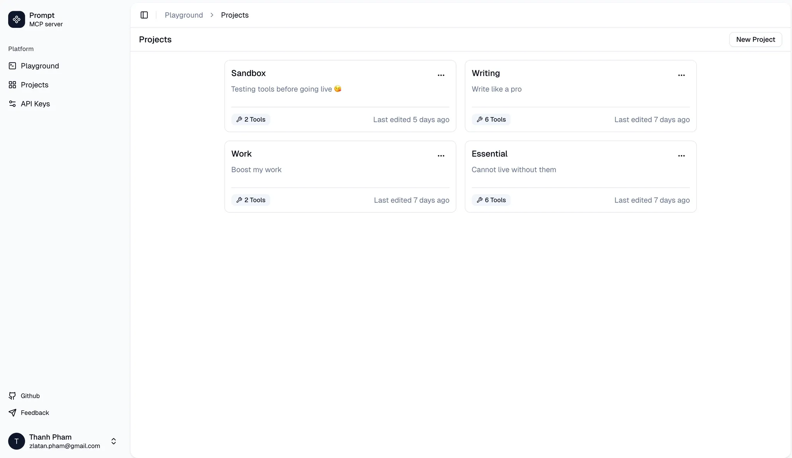
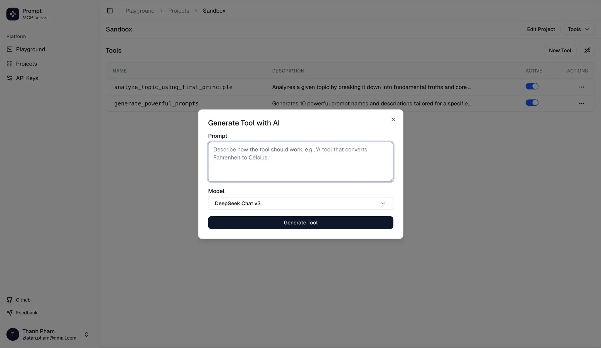
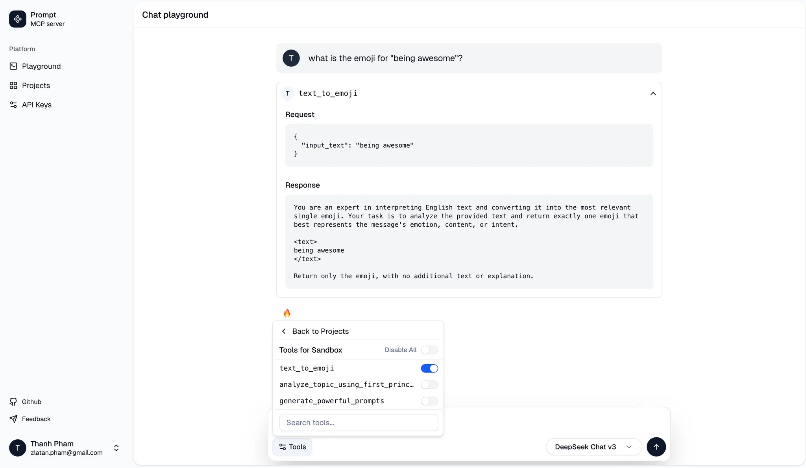
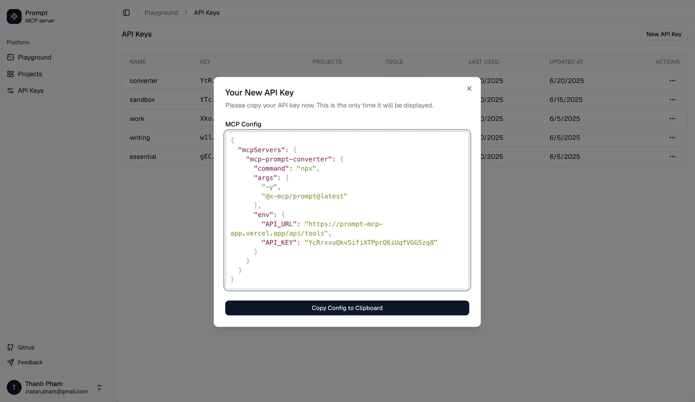

# Prompt MCP

An open-source application for managing AI prompts as MCP tools.

## About

This application helps to generate one-shot prompts and convert them to tools that can be used by an MCP client like Claude desktop, Cursor or Cline.

## Features

- **Prompt to Tool Conversion:** Create (or generate) one-shot prompts and convert them into reusable tools.
- **Testing Tools:** Test tools with a clean Chat interface.
- **MCP Export & Integration:** Export tools grouped under projects for integration with MCP clients (e.g., Claude desktop, Cursor, Cline).









## Built with T3 Stack

This project is built using the T3 stack, which includes:

- [Next.js](https://nextjs.org/)
- [Tailwind CSS](https://tailwindcss.com/)
- [shadcn/ui](https://ui.shadcn.com/)
- [Prisma](https://www.prisma.io/)
- [tRPC](https://trpc.io)
- [NextAuth.js](https://next-auth.js.org)

Further details about the T3 stack can be found in the [T3 Stack documentation](https://create.t3.gg/).

## Getting Started for Developers

To get started with development, follow these steps:

### Requirements

- Node.js >= 18.0.0
- pnpm >= 8.6.12
- Docker Desktop (for local Postgres)

### Setup

1.  **Environment Variables:** Create a `.env` file from `.env.example` and configure necessary environment variables.
2.  **Database:**
    ```bash
    ./start-database
    ```
3.  **Install Dependencies:**
    ```bash
    pnpm install
    ```
    Database migrations will run automatically during the installation process.

### Running the app

To run the app locally for development:

```bash
pnpm run dev
```

Open [http://localhost:3000](http://localhost:3000) to view the app in your browser.

## Contributing

Contributions, suggestions, bug reports and fixes are welcome!

For new features or components, please open an issue and discuss before sending a PR.

## License

This project is licensed under the MIT License. See the [LICENSE](LICENSE) file for details
